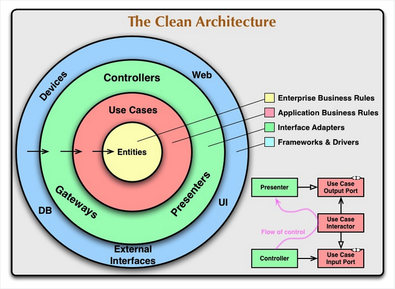
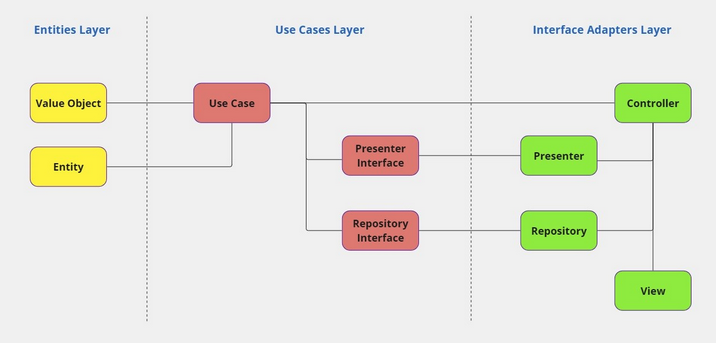

# The Clean Architecture and a Python implementation
Implementation of In-Memory CLI

## The Clean Architecture
- The Clean Architecture is a software architecture `methodology` created by Robert C. Martin (also known as Uncle Bob). It was influenced by `Hexagonal` and `Onion Architecture`, which are all `Layered Architectures`.

- The `objective` of the Clean Architecture is to `separate` the `main codebase` of the application from `parts of the code` that deal with `external libraries and systems`.
    - the separation of concerns (dividing the software into layers)
        - It has at least 1 layer for `business rules`
        - Another for `interfaces`
    - It is not much of a problem when the codebase is `small`. But, the `bigger` the codebase, the harder it will be to maintain it.
    - We should `avoid` coupling as much as possible to `improve` maintainability and reduce code conflicts
        - [SOLID principles](https://www.linkedin.com/pulse/python-recommended-coding-practices-part-3-solid-watanabe/?lipi=urn%3Ali%3Apage%3Ad_flagship3_pulse_read%3BU0M1cJAgTH%2BMUjFTqQDCig%3D%3D)

- Characters:
    - Independent of Frameworks
    - Testable
    - Independent of UI
    - Independent of Database
        - Your business rules are not bound to the database.
    - Independent of any external agency
        - Your business rules simply don’t know anything at all about the outside world.

- Clean Architecture is divided into layers as shown in the picture below

    

    - The Dependency Rule
        - The `outer` circles are `mechanisms`.
        - The `inner` circles are `policies`.
        - The `overriding rule` that makes this architecture work is `The Dependency Rule`.
            - It says that `source code dependencies` can only point `inwards`.
                - `Nothing` in an `inner` circle can `know` anything at `all` about something in an `outer` circle.
                - The name of something declared in an `outer` circle must `not` be `mentioned` by the code in the an `inner` circle.
                - That includes, functions, classes. variables, or any other named software entity.
    - Crucial principle:
        - Dependency Inversion

## The Clean Architecture Layers

### The Entities Layer
- Uncle Bob: `Entities encapsulate Enterprise wide business rules.`

- The Entities layer is the `innermost` layer of the Clean Architecture and represents the `domain models`.
    - `Question`: Objects, Entites, Models?
    - [Entities and Models](https://nanosoft.co.za/blog/post/clean-architecture-entity-model)

- The Entities layer code `can’t` access other layers, only code in the `same` layer.
    - The Entities layer can’t access the `database` as well.

- All `other` layers `can` access the entities layer.

- In this project, `the entites layers` will be implemented in a folder called `domain`

### The Use Cases Layer
- Uncle Bob: `The software in this layer contains application specific business rules. This layer is isolated from such concerns.`

- `Business rules` are implemented in the Use Cases layer => the `most` critical layer
    - It means that `the logic core` of this application is in this part of the software.

- It can access `the Entities layer`and `the Use Cases layer`.

- `The Use Cases layer` will be implemented in a folder called `interactor`.

### The Interface Adapters Layer
- Uncle Bob: `The software in this layer is a set of adapters that convert data from the format most convenient for the use cases and entities, to the format most convenient for some external agency such as the Database or the Web.`

- The Interface Adapters layer serves as an `interface` to external systems, facilitating a future switch of an external system.
    - For example, a change in the `storage system` (filesystem, different types of databases, etc).

- It can access the inner layers
    - Entities layer
    - Use Cases layer
    - Controllers’ code like CLI (Command Line Interface) or web related will access those inner layers.
    - For instance, when a user chooses an option on a CLI or submits a form in a web interface, code from the outer layers will call Use Cases layer code.

- To access the outer layers, the Use Cases layer must use an `interface` and `dependency inversion`.

- Folders named `app` and `infra` will implement `The Interface Adapters layer`

### The External Systems layer (aka Frameworks and Drivers)
- Uncle Bob: `The outermost layer is generally composed of frameworks and tools such as the Database, the Web Framework, etc.`

- A system built inside the company that doesn’t do business rules related to this specific project may also be in the External Systems layer.

- Code that lives in the External Systems layer can interact with `all` the other layers.

- Code folder named `...` that resides in the External Systems Layer

### Objectives
- all business rules complexity is isolated in the inner layers (entity and use case layers)
    - Easy to test
    - Easy to change the external system (use a different database or web framework, for example)
- to reduce complexity on the outer layers, 
- avoid decision making on those layers, including branches, ifs and alternative scenarios.

### Advantages
- Improve the separation of concerns and reducing coupling -> improving maintainability and reducing code conflicts
- The most cited characteristic of the CA is the ease of switching its components
    - the place where data is stored (databases, file,...)
    - the data input interface (CLI, Web API, ...)
- We can defer some decisions
    - For instance, which db we should choose
    - We can start with an inital prototype using `in-memory` objects
    - Then, after a thorough evaluation of the database options, we deploy the production version with the specific technology..
    - As a result, we could even compare some possibilities easily
- An easier testing process

### Disadvantages
- These layers may affect the application's performance
- An application following the Clean Architecture has a lot of boilerplate code.

## Implementation of the Entities layer
- Reference: [src/domain/README.md](../src/domain/README.md)

## Implementation of the Use Cases layer
- Reference: [src/interactor/README.md](../src/interactor/README.md)

## Implementation of the Interface Adapters layer
- Reference:
    - [src/infra](../src/infra/README.md)
    - [src/app](../src/app/README.md)

## Bird's Eye View of our Clean Architecture

## Other Implementations

## Recap
- It has some rules about how to structure your code. A software architecture `methodology`
- One crucial principle: `Dependency inversion`
- The core of Clean Architecture is the `Domain/Entities`.
- The other components of the system are there to support the Domain.
- Main layers
    - Entities layer (entities): `src/domain/entities` folder
    - Use Cases layer (interactor): `src/interactor` folder
    - Infrastructure layer (app & infra): `src/app` & `src/infra` folders
    - Presentation layer ()
- What is the value of Clean architecture?
    - Modularity
    - Separation of concerns
    - Testability of business logic
    - Improved team productivity
    - Loose coupling of components

# References
- [The Clean Architecture by Uncle Bob](https://blog.cleancoder.com/uncle-bob/2012/08/13/the-clean-architecture.html)
- [SOLID principles](https://www.linkedin.com/pulse/python-recommended-coding-practices-part-3-solid-watanabe/?lipi=urn%3Ali%3Apage%3Ad_flagship3_pulse_read%3BU0M1cJAgTH%2BMUjFTqQDCig%3D%3D)
- [An implementation of Clean Architecture in Python 1 - In-memory CLI](https://www.linkedin.com/pulse/implementation-clean-architecture-python-part-1-cli-watanabe/)
- [Why Clean Architecture Is Great For Complex Projects](https://www.milanjovanovic.tech/blog/why-clean-architecture-is-great-for-complex-projects)