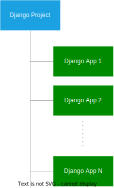

# Section 1: Django Basics
> Learning the basic Django concepts by building a blog that allows users to sign up, sign in and publish blog posts.

## Getting Started with Django
```
Objective
    - how to create a new Django project
    - understand the project structure
    - lauch the Django web app from a web browser
```

### Django overview
- a `Python web framework` that includes a set of components for solving common web development problems
- the DRY principles, to maximize the code reusability
- MVT (Model - View - Template) pattern
    - Model: defines the data or contains the logic that interacts with the data in the database
    - View: communicates with the database via model and transfers data to the template for representing the data
    - Templates: defines the template for displaying the data in the web browser
- it acts as a controller
- it uses URL patterns that send the request to an appropriate view

### Django architecture


### Creating a virtual environment
- A virtual environment creates an isolated environment that consists of an independent set of Python packages
- Steps
    - create a new directory `django-playground`: `mkdir django-playground`
    - navigate to the django-playground directory: `cd django-playground`
    - create a new virtual environment using the `venv` module: `python3 -m venv venv`
    - activate the virtual environment:
        - Windows: `venv\Scripts\activate`
        - MacOS/Linux: `source venv/bin/activate`
    - deactivate the virtual environment using the deactivate command: `deactivate`

### Install the Django package
- [PyPi](https://pypi.org/project/Django/)
- [ver 4.2.9](https://docs.djangoproject.com/en/5.0/releases/4.2.9/)
- Steps
    - `pip install django==4.2.9`
    - `python3 -m django --version`

### Exploring Django Commands
- To list all available Django commands: `django-admin`
- To creates a new Django project: `django-admin startproject <project_name>`
    - `django-admin startproject django_project`
    - `django_project` structure:
    ```
        ├── django_project: is a Python package that consists of the following files
        | ├── asgi.py: contains the configurations that run the project as an asynchronous web server gateway interface (AWSGI) application with AWSGI-compatible web servers
        | ├── settings.py: contains the project settings such as installed applications, database connections, and template directories
        | ├── urls.py: stores a list of routes that map URLs to views
        | ├── wsgi.py: contains the configurations that run the project as a web server gateway interface (WSGI) application with WSGI-compatible web servers
        | └── __init__.py: is an empty file indicating that the django_project directory is a package
        └── manage.py: is a command-line program that you use to interact with the project like starting a development server and making changes to the database
    ```
        
### Running the Django development server
- To run the Django development server: `python3 manage.py runserver`
- open the web app using the URL listed in the output: `http://127.0.0.1:8000/`
- `django_project/url.py`: contains a default route that maps `/admin` path with the `admin.site.urls` view
- To open the admin page, you use the following URL: `http://127.0.0.1:8000/admin`

### Stop the Django development server
- press the Ctrl-C (or Command-C) twice.

### Create requirements.txt file
- It contains all dependencies for a specific Django project
- To create a `requirements.txt` file: `pip freeze > requirements.txt`
- When you move the project to a new server e.g., a test or production server: `pip install -r requirements.txt`

### Summary
- Django is a Python web framework that allows you to rapidly develop web applications.
- Django uses the MVT (Model-View-Template) pattern, which is similar to the MVC (Model-View-Controller) pattern.
- Use the django-admin startproject new_project command to create a new project.
- Use the python manage.py runserver command to run the project using the Django development web server.
- Press Ctrl-C (or Cmd-C) to stop the Django development web server
- [Reference](https://www.pythontutorial.net/django-tutorial/getting-started-with-django/)

## Django Create App
```
Objective
    - How to create a new application in a Django project
    - How to define views and map the views with URLs
```

### Django projects and applications
- `A project` is a Django installation with some settings.
- `An application` is a group of models, views, templates, and URLs.
- `A project` may have `one or more applications`.
    - for example, a project is like a website that may consist of apps such as blogs, users, and wikis
    - structure

        

### Creating a blog application
- To create an application, use: `python3 manage.py startapp <app_name>`
    - For example: `python3 manage.py startapp blog`
    - After creating a new `blog` app
    ```
    ├── blog
    |  ├── admin.py
    |  ├── apps.py
    |  ├── migrations
    |  ├── models.py
    |  ├── tests.py
    |  ├── views.py
    |  └── __init__.py
    ├── db.sqlite3
    ├── django_project
    |  ├── asgi.py
    |  ├── settings.py
    |  ├── urls.py
    |  ├── wsgi.py
    |  ├── __init__.py
    |  └── __pycache__
    └── manage.py
    ```

### Registering an application
- After creating an app, we need to `register` it to the project
    - To register the `blog` app, adding the `blog.apps.BlogConfig` class to the `INSTALLED_APPS` list in the [settings.py](./django-playground/django_project/django_project/settings.py) of the project
- The `blog` app has `apps.py` module which contains the `BlogConfig` class

### Creating a view
- Checking [views.py](./django-playground/django_project/blog/views.py) file in the `blog` directory
    - it will contain all the views of the application
    - A view is a function that takes an `HttpRequest` object and returns an `HttpResponse` object -> `a function-based view`
    - Create a `new view` > `def home()`
- To map a URL with a function-based view, create a file `urls.py` inside the `blog` directory
    - [urls.py](./django-playground/django_project/blog/urls.py)
    - `path` function
        - the `name` keyword argument defines the name of the route
        - we can reference the URL using the route name instead of the hard-code URL like `blog/`
        - `Note` that the final argument of the path must be a keyword argument like `name='posts'`
        - [See more]()
            - tutorial01
            - django.urls functions for use in URLconfs
            - URL dispatcher: Naming URL patters
- To make the `blog`'s routes work, we need to include the `urls.py` of the `blog` application in the [urls.py](./django-playground/django_project/django_project/urls.py) file of the Django project.
    - navigate to `http://127.0.0.1:8000/blog/`
    - result: Django will run the `home()` function of the `views.py` module and returns a webpage that displays a `h1` tag.
- flow: HTTP request -> `http://127.0.0.1:8000/blog/` -> executes the `urls.py` in the `django_project` directory. -> finding the matched URL -> Django runs the `urls.py` file in the `blog` application. -> finding the matched URL -> execute function with found function -> Django returns a webpage to the web browser

### Adding more routes
- define the `about()` function in the `views.py` of the `blog` application
- add a route to the `urls.py` file in the `blog` directory
- open the URL `http://127.0.0.1:8000/blog/about/`
- To make the `blog` application the `homepage`, you can change the route from `blog/` to `''`

### Summary
- A Django project contains one or more applications.
- A Django application is a group of models, views, templates, and URLs.
- Use python `manage.py startapp app_name` command to create a new Django application.
- Define a function in the `views.py` file to create a function-based view.
- Define a route in the `urls.py` file of the application to map a URL pattern with a view function.
- Use the `include()` function to include the `urls.py` of app in the `urls.py` of the project.

## Django Templates
```
Objective
    - How to create Django templates
    - How to pass data from view functions to templates
    - HOw to display the data in the templates
```

### Introduction to the Django templates
- To return a full HTML page, you'll need to use a template
    - `Note`: we can return a full HTML page by mixing the HTML with Python code, but this is not practical and doesn't scale well.
- A template is a file that contains the static and dynamic parts of a webpage
- To generate the dynamic of the webpage, Django uses `Django template language - DTL`
- The Django template engine renders template that contain:
    - Variables
        - they are surrounded by `{{` and `}}`
        - for example: `Hi {{name}}, welcome back!`
        - they can be a `string`, or `dictionary`,...

    - Tags
        - they are responsible for outputting contents, serving a control structure if-else, for-loop, and getting data from a database
        - they are surrounded by ``
        - for example
            - ``, this generates a token for preventing CSRF attacks
            - if-else
                ```
                    
                    Hi {{user.username}}
                    
                ```

    - Filters
        - transform the contents of variables and tags argument
            - for example: to capitalize each word of a string, we use the `title` filter
                ```
                {{name | title}}

                if name = "john doe" then title(name) = John Doe
                ```
        - some filters accept an argument
            - for example: to format a date of the `joined_date` variable in the `Y-m-d` format
                ```
                {{ joined_date | date: "Y-m-d" }}
                ```
        - [built-in template tags and filters]()

    - Comments
        - they will look like this
            - `{ # This is a comment in the template }`
        - The Django template engine will not render text inside the comment blocks

### Django template examples
#### 1. creating `templates` directory inside the `blog` directory
- `mkdir templates`
#### 2. creating a `blog` directory inside the `templates` directory
- `cd templates`
- `mkdir blog`
- `note`: the directoru inside the `templates` directory must have the `same` name as the `application`
#### 3. Inside the `templates/blog` directory, creating 2 template files
- home.html
- about.html
- `note`
    - we should add the `blog` app (blog.apps.BlogConfig) to the `INSTALLED_APPS` list in the [settings.py](./django-playground/django_project/django_project/settings.py#INSTALLED_APPS) to `make the templates work`
    - we should do it `immediately` after `creating the new Django application`
#### 4. Opening the `views.py` file
- [views.py](./django-playground/django_project/blog/views.py)
- change the `home()` and `about()` view functions
#### 5. Run the Django development server
- `python3 manage.py runserver`
- opent the URL `http://127.0.0.1:8000/` for `home.html` template and `http://127.0.0.1:8000/about/` for `about.html` template

### Passing variables to a template
- Creating dummy blog post data and pass it to the [home.html](./django-playground/django_project/blog/templates/blog/home.html)
- Learning how to get the post data from the database
- [views.py](./django-playground/django_project/blog/views.py)
    - creating a new list (posts)
    - define a new dictionary `context` inside the `home()` function
    - example of `if-else`, `for-loop`

### Creating a base template
> A website has some common sections like a header, footer and sidebar. To avoid repeating them in every template, you can use a base template

#### 1. Creating a new `templates` directory in the project directory (not `blog` app)
```
    ├── blog
    ├── db.sqlite3
    ├── django_project
    ├── manage.py
    ├── templates *
    └── users
```

#### 2. Adding the template directory to the `TEMPLATES` option in the `settings.py` file of the project
- [settings.py](./django-playground/django_project/django_project/settings.py#TEMPLATES)
- Note
    - `BASE_DIR` is a [path]() object that comes from the `pathlib` built-in module
    - The forward-slash `/` is an operator that concatenates the `BASE_DIR` object with the '`templates`' string => [operator overloading]() in Python

#### 3. Creating `base.html` in the `templates` directory
- [base.html](./django-playground/django_project/templates/base.html)
- change the `home.html` template inside the `templates/blog` directory
    - [home.html](./django-playground/django_project/blog/templates/blog/home.html)
    - `extends` tag
- restart server and open URL `http://127.0.0.1:8000/`

### Configure static file
- The static files are CSS, Javascript and image files that you use in the templates
#### 1. Create a `static` directory inside the project directory
- `mkdir static`
- structure
```
    ├── blog
    ├── db.sqlite3
    ├── django_project
    ├── manage.py
    ├── templates
    ├── static *
    └── users
```
#### 2. Set the `STATICFILES_DIRS` in the `settings.py` after the `STATIC_URL` file
- [settings.py](./django-playground/django_project/django_project/settings.py#STATICFILES_DIRS)
- This will helps Django can find the static files in the static directory
```
STATIC_URL = 'static/'
STATICFILES_DIRS = [BASE_DIR / 'static']
```

#### 3. Create 3 directories `js`, `css`, `images` directory inside the `static` directory
- `static` directory
```
├── static
    ├── css
    ├── images
    └── js
```

#### 4. create `style.css` inside the CSS directory
- [style.css](./django-playground/django_project/static/css/style.css)

#### 5. create the `app.js` insde the `js` directory
- [app.js](./django-playground/django_project/static/js/app.js)

#### 6. Edit the `base.html` template to load the `style.css` and `app.js` files
- [base.html](./django-playground/django_project/templates/base.html)

#### 7. Restart server and open URL `http:127.0.0.1/`

### Summary
- A Django template contains both static and dynamic parts of a web page.
- Django uses Django Template Language (DTL) by default to create templates.
- Use {{ variable_name }} to display the value of the variable_name in a template.
- Use  to include a control tag in a template.
- Use the static tag to load the static files including CSS, JavaScript, and images.

## Django Models
```
Objective
    - Learn about Django models
    - How to create models for Django application
```

### Introduction to Django models

- A model is a subclass of the [django.db.models.Model](https://docs.djangoproject.com/en/4.2/ref/models/instances/#django.db.models.Model) class
- A model contains one or more fields and methods that manipulate the fields
- a Django model maps to a single table in the database in which each field of the model represents a column in the table
- An application may have zero or more models stored in `models.py` module

#### Defining models
- Example: 
    - [Post model](./django-playground/django_project/blog/models.py#)
    - Based on the defined `Post` model, Django will create a table in DB with SQL code
    - Django will create a table `blog_post` for the `Post` model
- The name of the table `blog_post` is automatically derived from the application and model names: `application.model`
- Using the `db_table` attribute of the `Meta` class to specify a table name instead of using the default name generated by Django
- After that, Django automatically adds the `id` field as the primary key of the table
    - [settings.py](./django-playground/django_project/django_project/settings.py#DEFAULT_AUTO_FIELD)
- If we want to sepecify our own primary key field, we need to explicitly define it in the [model](./django-playground/django_project/blog/models.py)
    - Django requires each model to have `exactly one field` with the `primary_key=True`

#### Using models
- After defining
- We need to tell Django that we're going to use them by registering the application name in the `INSTALLED_APPS` list in the [settings.py](./django-playground/django_project/django_project/settings.py#INSTALLED_APPS) of the project
    - `'blog.apps.BlogConfig',`

#### Built-in models
- Django comes with some built-in models like `User` from `django.contrib.auth.models` module
- To use the `User` model, you need to import it into the [models.py](./django-playground/django_project/blog/models.py) file

#### Foreign keys
- Each post in the `blog` application is created by a `user` and a user may create zero or more posts - `one-to-many` relationship
- To model the `one-to-many` relationship, we use the `ForeignKey` field
    - [ForeignKey field](./django-playground/django_project/blog/models.py)
    - Based on that, Django will create the `blog_post` table with SQL code with `author_id` field

#### The __str__() method
- To define the string representation of a model, you can override the `__str__()` method. 
- When you use the `instance` of the Post model as a string, Django calls the `__str__()` method and displays its result.

#### Adding Meta class to the Model class
- The `Meta` class allows you to configure the model
- For example, the following defines the `Meta` class inside the `Post` model class that sorts the posts by the `published_at` in descending order (`-published_at`) i.e., the newer posts first and the older posts after.

#### Summary
- Define all models in the `models.py` file of the Django `application`.
- Define a class that inherits from the `django.db.models.Model` to create a model.
- A model maps to a table in the database, in which each field maps to a column in the database table.
- Override `__str__()` method to return a string representation of a model.
- Use the `Meta` class to configure the model.

## Django Migrations
> How to create models and use Django migrations to create database tables

### Introduction to Django migration commands
- We don't need to write SQL to create new tables or make changes to existing tables -> Instead, using `Django migrations`
- It allows us to propagate the changes that we make to the [models](./SECTION-1.md#DjangoModels) to the DB via the CMD
- Django provides some commands for
    - Creating new migrations based on the changes that we made to the model
    - Applying the migrations to the DB
- The process for making changes to models, creating migrations, and applying the changes to the DB
    - Define new models or make changes to existing models
    - Make new migrations by running the `makemigrations` command
    - Apply the changes from the models to the DB by executing the `migrate` command

### Example
- Define the [Post](./django-playground/django_project/blog/models.py#Post) models in the `blog` app
- Creating a new migration using the `makemigrations` command
    - `python3 manage.py makemigrations`
    - This command scans the `models.py` file, detects changes and makes corresponding migrations
    - Output: The command creates the file `migrations/0001_initial.py`
        ```
        Migrations for 'blog':
        blog/migrations/0001_initial.py
          - Create model Post
        ```
- To preview the SQL that Django will run to create the `blog_post` table in the DB
    - We use the `sqlmigrate` command
    - Command: `python3 manage.py sqlmigrate blog 0001`
        - `blog` is the name of the application
        - `0001` is the migration number
    - It will output a SQL code to preview
- To apply the changes to the DB, we execute the `migrate` command
    - command: `python3 manage.py migrate`
    - Beside applying the migration for the `Post` model, Django also applied for the `built-in` models used in `authentication`, `authorization`, `sessions`,...
    - Try to execute the `migrate` command again
- To list the project migrations and their status
    - We use the `showmigrations` command
    - command: `python3 manage.py showmigrations`

### Summary
- Use the `makemigrations` command to make migrations based on the changes that you made to the models.
- Use the `migrate` command to apply changes from models to the database.
- Use the `sqlmigrate` command to view the generated SQL based on the model.
- Use the `showmigrations` command to list all migrations and their status in the project.

## Django Admin Page
> How to create a superuser and use it to sign in to the Django admin page

### Introduction to the Django admin page
- When we create a project using `startproject` command, the admin page is generated automatically for managing models including creating, reading, updating, and deleting
- Supporting basic CRUD feature
- Access: `http://127.0.0.1/admin/`
    - Django specifies the `admin/` in the `urls.py` of the project

### Creating a superuser account
- To create a superuser account
    - command: `python3 manage.py createsuperuser`
    - prompt following the instructions
    - command: `python3 manage.py runserver`
    - login using created acc
- To show the `Post` model on the `admin page`, we need to register it in the `main.py` of the `blog` application
    - `admin.site.register(Post)`
    - [admin.py](./django-playground/django_project/blog/admin.py)

### Display data from the database
- To display the posts from the database, we need to change the `home()` function in the [views.py](./django-playground/django_project/blog/views.py#home) of the `blog` application

### Summary
- Django comes with a default admin panel that allows us to manage users, groups, and models
- Use the `createsuperuser` to create a superuser for logging in to the Django admin site
- Use the `admin.site.register` method to register a model to the admin panel
- Use the `all()` method of the `Model.objects` to get all models as a `QuerySet` from the database

## Django Form
> How to create a Django Form to CRUD Post models of the blog application
> Django admin is good engouh for admin to manage the contents based on the models
> But, the users of the website also can manage their content, we need to create separate forms for them

### Introduction to the Django Form

### Defining a form

### Summary
- Create a model form by subclassing the `ModelForm`
- Add the `novalidate` property to the form to disable HTML5 validation temporarily for testing server validation
- Use `form.is_valid()` to check if the form is valid
- Use `form.save()` to save form values into the database
- Use `redirect()` to redirect to a path