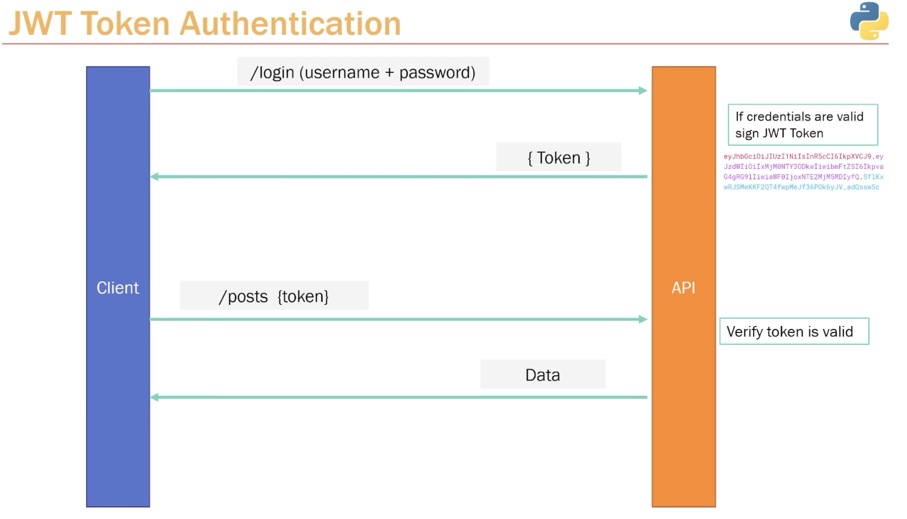
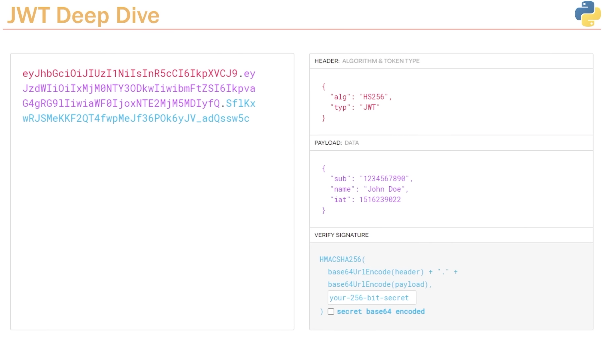
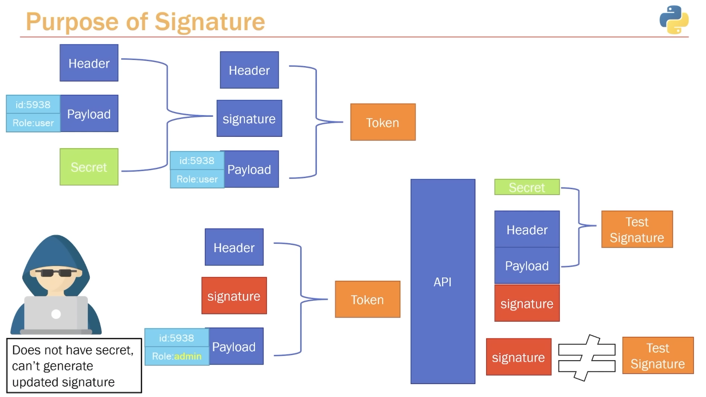
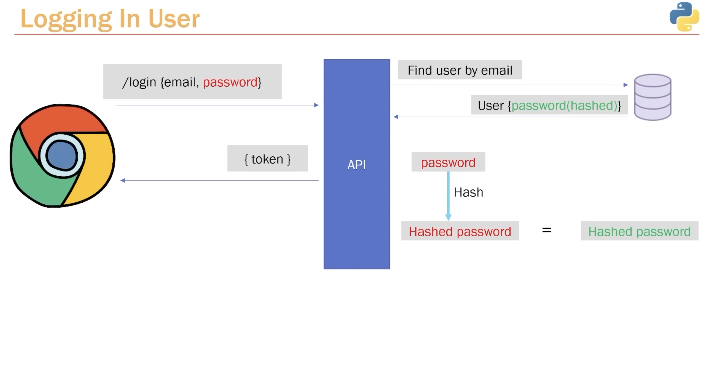

# Authentication & Users

- [Creating Users Table](https://www.youtube.com/watch?v=0sOvCWFmrtA&t=21008s)
    - `@app.post("/users", status_code=status.HTTP_201_CREATED, response_model=schemas.UserOut)`
    - Defining our `Users` table: 
    - `models.py`: app.models.User
    - `Next`: creating new path operation for `Users`

- [User Registration Path Operation](https://www.youtube.com/watch?v=0sOvCWFmrtA&t=21290s)
    - `schemas.py`
    - create schema: `UserCreate`
        - [EmailStr](https://docs.pydantic.dev/1.10/usage/types/#pydantic-types)
    - create schema: `UserOut`
        - input: ORM
        - process: sqlalchemy
            - class Config
            - We need `pydantic` to `convert` it to `a regular pydantic`
        - output: ORM

- [Hashing Passwords](https://www.youtube.com/watch?v=0sOvCWFmrtA&t=21807s)
    - Why we need to use hasing password
    - [OAuth2 with Password (and hashing), Bearer with JWT tokens](https://fastapi.tiangolo.com/tutorial/security/oauth2-jwt/#oauth2-with-password-and-hashing-bearer-with-jwt-tokens)
        - pip install "passlib[bcrypt]"
        - `from passlib.context import CryptContext`
        - what hasing algorithm we use
            - `pwd_context = CryptContext(schemes=["bcrypt"], deprecated=auto)`
        
- [Refractor Hashing Logic](https://www.youtube.com/watch?v=0sOvCWFmrtA&t=22129s)
    - extract all hashing logic and store it in its own function
    - `utils.py`

- [Get User by ID](https://www.youtube.com/watch?v=0sOvCWFmrtA&t=22232s)
    - `@app.get("/users/{id}")`
    - `schemas.py`: UserOut

- [FastAPI Routers](https://www.youtube.com/watch?v=0sOvCWFmrtA&t=22633s)
    - creating 2 saparate files for `Users` and `Posts`
    - routers
        - from `routers/users.py`, `routers/posts.py` -> how to import `app` instance from `main.py`
            - `from fastapi import APIRouter`
            - `routers/users.py`: @router.post, @router.get
            - `routers/posts.py`: @router.get, @router.delete, @router.put, @router.post
        - main.py: `app.include_router(post.router)`
        - main.py: `app.include_router(user.router)`
    - Custom APIRoute class in a router
    - Include an APIRouter in another
        
- [Router Prefix](https://www.youtube.com/watch?v=0sOvCWFmrtA&t=23254s)
    - Context: what if our url is long, complex
    - Using `prefix`
        - router = APIRouter(`prefix="/posts"`)

- [Router Tags](https://www.youtube.com/watch?v=0sOvCWFmrtA&t=23431s)
    - structuring api documentation
        - `routers/user.py`: router = APIRouter(prefix="/users", `tags=["Users"]`)
        - `routers/post.py`: router = APIRouter(prefix="/posts", `tags=["Posts"]`)

- [JWT Token Basics](https://www.youtube.com/watch?v=0sOvCWFmrtA&t=23569s)
    - stateless
    - Client treats JWT token as string
    - Only BE does care what JWT token and what does it mean
    - Flows using JWT token
        - How user logs in
        - How a user essentially authenticated
        - How a user accesses a specific path operation resource or endpoint

            

    - Dive into JWT Token
        - Header: algorithm + type
        - Payload
            - Up to you
            - You can include whatever you want
            - Note: Anytime we access anything authenticated, we have to include token
        - Verify signature: is a combination of 3 things
            - header
            - payload
            - our secret

        

    - Purpose of Verify Signature    
        - Data integrity

        

- [Login Process](https://www.youtube.com/watch?v=0sOvCWFmrtA&t=24423s)
    - Diagram

        

    - Practice
        - `routers/auth.py`
        - `utils.py`

- [Creating Token](https://www.youtube.com/watch?v=0sOvCWFmrtA&t=25244s)
    - routers/auth.py: `@router.post("/login")`
    - utils.py: `def verify(plain_password: str, hashed_password)`

- [OAuth2 PasswordRequestForm](https://www.youtube.com/watch?v=0sOvCWFmrtA&t=25798s)
    - Install python-jose: `pip install "python-jose[cryptography]"`
    - `oauth2.py`
        - `def create_access_token(data: dict)`
    - `auth.py`
        - `from fastapi.security.oauth2 import OAuth2PasswordRequestForm`
        - `user_credentials: OAuth2PasswordRequestForm = Depends()`
    - OAuth2PasswordRequestForm only receives `username` and `password`, so we need to use `form` in Postman
        - `query_statement = db.query(models.User).filter(models.User.email == user_credentials.username)`
- [Verify user is Logged In](https://www.youtube.com/watch?v=0sOvCWFmrtA&t=26003s)
    - Handling the logic for verifying that the token is still valid
    - define schema for the token
        - `schemas.py`
            - class Token(BaseModel):
            - class TokenData(BaseModel):
        - `oauth2.py`
            - `from fastapi.security import OAuth2PasswordBearer`
                - oauth2_scheme = OAuth2PasswordBearer(tokenUrl="login")
            - verify_access_token
            - get_current_user
            
        - `@router.post("/", status_code=status.HTTP_201_CREATED, response_model=schemas.Post)`
            - get_current_user: int = Depends(oauth2.get_current_user)
            
- [Fixing Bugs](https://www.youtube.com/watch?v=0sOvCWFmrtA&t=26721s)
    - `oauth2.py`
        - create_access_token
            - expire = datetime.now() + timedelta(minutes=ACCESS_TOKEN_EXPIRE_MINUTES) -> expire = datetime.utcnow() + timedelta(minutes=ACCESS_TOKEN_EXPIRE_MINUTES)
        - verify_access_token
            - algorithms=ALGORITHM -> algorithms=[ALGORITHM]
    - `auth.py`
        - `HTTPException(status_code=status.HTTP_404_NOT_FOUND, detail="Invalid credentials")` -> raise HTTPException(status_code=status.HTTP_403_FORBIDDEN, detail="Invalid credentials")

- [Protecting Routes****](https://www.youtube.com/watch?v=0sOvCWFmrtA&t=26879s)
    - login
    - create post
    - test all api after add protecting router
    - [question](https://github.com/tiangolo/fastapi/issues/4102)
    - [anwser](https://fastapi.tiangolo.com/tutorial/security/first-steps/#what-it-does)
    - [Inject the current user](https://fastapi.tiangolo.com/tutorial/security/get-current-user/#inject-the-current-user)

- [Test Expired Token](https://www.youtube.com/watch?v=0sOvCWFmrtA&t=27377s)
    - ACCESS_TOKEN_EXPIRE_MINUTES = 1

- [Fetching User in Protected Routes](https://www.youtube.com/watch?v=0sOvCWFmrtA&t=27493s)
    - Question: Why exactly do we have this `get_current_user` function ?
    - `oauth2.py`
        - get_current_user()

- [Postman advanced Features]()
    - Environments
        - Development environment: `http://127.0.0.1:8000/...`
        - Deploy application on prod, dev,...
        - HTTP, HTTPS
        - change from `hard code` -> `flexible code` that changes on what environment we use
        - How to create environment variables
    - Set an environment variable through code
        - Example: Automatically import `Bearer {token}`
        - Reference to `SNIPPETS` to know how to create through examples
        - [Snippet: Set an environment variable](https://github.com/rangav/thunder-client-support#set-environment-variables-in-scripting)
        - Way 1: Set on `login` path
            - Login Collections: `Collections/python-fastapi/Login user`
                - Select `Tests` tab
                - On `Tests`, set `json.access_token = {{JWT}}`
            - [Solution](https://stackoverflow.com/questions/73579200/thunderclient-how-to-pass-a-response-value-to-the-next-request)
        - Way 2: To save to active environment
            - `tc.setVar(varName, value);`

## References
- [Environment variable](https://github.com/rangav/thunder-client-support/blob/master/docs/filters.md#scripting)
- [Documentation ThunderClient](https://github.com/rangav/thunder-client-support/blob/master/docs/tc-types.d.ts)
- [Schemas Type EmailStr](https://docs.pydantic.dev/1.10/usage/types/#pydantic-types)
- [Security](https://fastapi.tiangolo.com/tutorial/security/)
- [`APIRouter` class](https://fastapi.tiangolo.com/reference/apirouter/)
