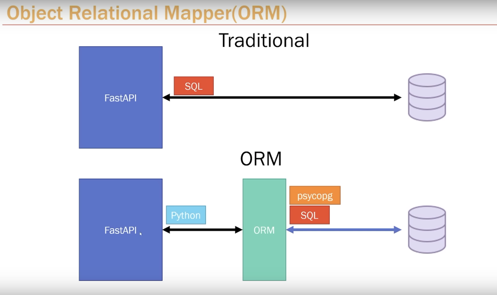
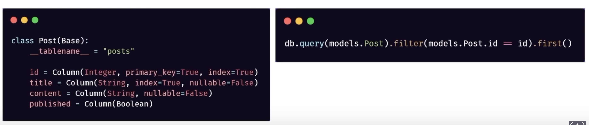

# ORM

- Why
    - Layer of `abstraction` that sits `between` the database and us
    - We can `perform` all database operations `through` traditional python code. `No more SQL`!

- ORM vs Traditional (Raw SQL)
    - Diagram

        

    - Usage
        - Abstracting the complexity way to generate and build queries, create & define table based on Python Objects

- What can ORMs do?
    - Instead of manually defining tables in postgres (e.g. PGAdmin), we can define our tables as python models
    - Queries can be made exclusively through python code. No SQL necessary
    - Example

        

- [SQLALCHEMY setup](https://www.youtube.com/watch?v=0sOvCWFmrtA&t=16533s)
    - SQLALCHEMY is one of the most popular Python ORMs
    - It is a standalone library and has `no` association with FastAPI. It can be used with any other Python web frameworks or any Python based application
    - [SQL (Relational) Databases Guide](https://fastapi.tiangolo.com/tutorial/sql-databases/)
    - [ORM usage v1.4](https://docs.sqlalchemy.org/en/14/)
        - [Installation](https://docs.sqlalchemy.org/en/14/intro.html#installation)
        - [Session Usage and Guideline](https://docs.sqlalchemy.org/en/14/orm/session.html)

- [creating requirements.txt - pip freeze](https://pip.pypa.io/en/stable/cli/pip_freeze/)

- File `database.py`
    - [Create the SQLAlchemy `engine`](https://fastapi.tiangolo.com/tutorial/sql-databases/#create-the-sqlalchemy-engine)
    - [Create a `SessionLocal` class](https://fastapi.tiangolo.com/tutorial/sql-databases/#create-a-sessionlocal-class)
    - [Create a `Base` class](https://fastapi.tiangolo.com/tutorial/sql-databases/#create-a-base-class)
        - We will inherit from this class to create each of the database models or classes (the ORM models)

- File `models.py`
    - [Create the database models](https://fastapi.tiangolo.com/tutorial/sql-databases/#create-the-database-models)
        - Create model attributes/columns: `post` model
    - [Main FastAPI app](https://fastapi.tiangolo.com/tutorial/sql-databases/#main-fastapi-app)
        - [Create the database tables - main.py](https://fastapi.tiangolo.com/tutorial/sql-databases/#create-the-database-tables)
            - `models.Base.metadata.create_all(bind=engine)`
        - create dependency - main.py
        - each of path operation function: 
            - `db: Session = Depends(get_db)`
            - test router: `@app.get("/sqlalchemy")`
            - test server: `uvicorn app.main:app --reload`
- File `schemas.py`
    - [Use Pydantic's `orm_mode`](https://fastapi.tiangolo.com/tutorial/sql-databases/#use-pydantics-orm_mode)
    - The [Config](https://pydantic-docs.helpmanual.io/usage/model_config/) class is used to provide configurations to Pydantic.
    - Pydantic's `orm_mode` will tell the Pydantic *model* to read the data even if it is not a dict, but an ORM model (or any other arbitrary object with attributes).
    - And with this, the Pydantic *model* is compatible with ORMs, and you can just declare it in the `response_model` argument in your path operations.
    
- Moving `get_db()` from `main.py` to `database.py`

- [Create a dependency](https://fastapi.tiangolo.com/tutorial/sql-databases/#create-a-dependency)
    - injecting `db: Session = Depends(get_db)`
    - each of pat operation function as a `parameter`

- Try to delete `post` table and restart server again

- [Adding CreatedAt Column](https://www.youtube.com/watch?v=0sOvCWFmrtA&t=17725s)

    - [Alembic Note](https://fastapi.tiangolo.com/tutorial/sql-databases/#alembic-note)
        - Handling migrate database
            - [Migrations](https://fastapi.tiangolo.com/tutorial/sql-databases/#migrations)
    - created_at: `from sqlalchemy.sql.sqltypes import TIMESTAMP`

- [Get All](https://www.youtube.com/watch?v=0sOvCWFmrtA&t=18059s)
    - [Read data](https://fastapi.tiangolo.com/tutorial/sql-databases/#read-data)
    - `@app.get("/sqlalchemy")`
    - `db.query(models.Post)` 
        - it returns a regular SQL statement
        - it abstracts all of the SQL away from you

- [Create](https://www.youtube.com/watch?v=0sOvCWFmrtA&t=18475s)
    - [Create data](https://fastapi.tiangolo.com/tutorial/sql-databases/#create-data)
    - `@app.post("/posts", status_code=status.HTTP_201_CREATED)`
    - After create, we need to call `commit()`
    - If we have 50 fields, we should use `unpacking`
        - Example: `**post.dict()`

- [Get by ID](https://www.youtube.com/watch?v=0sOvCWFmrtA&t=18950s)
    - [Read data](https://fastapi.tiangolo.com/tutorial/sql-databases/#read-data)
    - `@app.get("/posts/{id}")`

- [Delete](https://www.youtube.com/watch?v=0sOvCWFmrtA&t=19190s)
    - `@app.delete("/posts/{id}", status_code=status.HTTP_204_NO_CONTENT)`

- [Update](https://www.youtube.com/watch?v=0sOvCWFmrtA&t=19351s)
    - `@app.put("/posts/{id}")`

# References
- [SQL (Relational) Databases Guide](https://fastapi.tiangolo.com/tutorial/sql-databases/)
- [ORM usage v1.4](https://docs.sqlalchemy.org/en/14/)
- [ORM Installation](https://docs.sqlalchemy.org/en/14/intro.html#installation)
- [ORM Session Usage and Guideline](https://docs.sqlalchemy.org/en/14/orm/session.html)
- [Creating requirements.txt - pip freeze](https://pip.pypa.io/en/stable/cli/pip_freeze/)